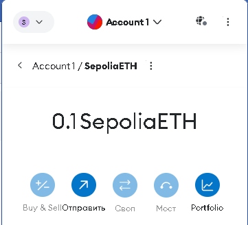

# Configuring
1. Configure environment to run web3.js and install library web3.js

2. Configure web3.js to run with Ganache and/or any Public Testnet
```javascript
const infuraApiKey = '18bf6c6f071d4f949e9ecc4a2525d260';
const web3 = new Web3(`https://sepolia.infura.io/v3/18bf6c6f071d4f949e9ecc4a2525d260`, { timeout: 60000 });
```
3. Configure Metamaskwith Ganacheand/or any PublicTestnet

4. Deploy the contract from Assignment 1 toGanacheand/or any PublicTestnet

5. Call any functions of smart contract from step 4 from environment which you have configured from steps 1,2,3
   
```javascript
contract.methods.balanceOf(userAddress).call()
    .then(balance => {
        console.log(`Balance of ${userAddress}: ${balance} tokens`);
    })
    .catch(error => {
        console.error('Error checking balance:', error);
    });
```

